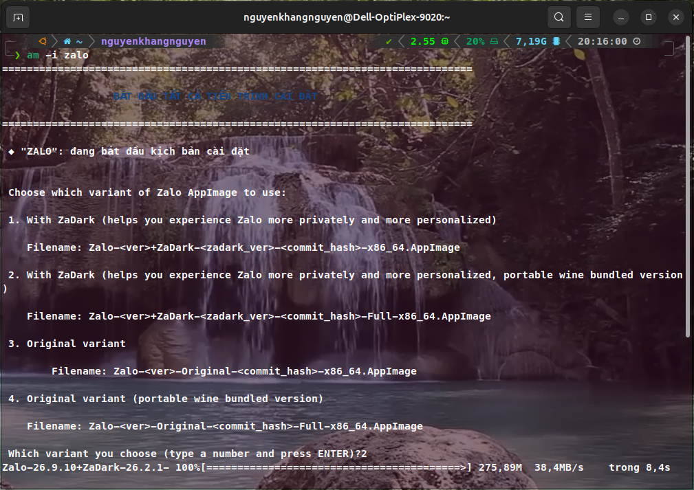

# Zalo for Linux 🐧

**English** | [Tiếng Việt](./readme/README.vi.md)

[](https://github.com/VN-Linux-Family/zalo-for-linux/actions/workflows/build.yml)

An unofficial, community-driven port of the Zalo desktop application for **Linux only**, created by repackaging the official macOS client into a standard AppImage with integrated ZaDark.

Thanks **realdtn2** for the solution: [realdtn2/zalo-linux-2026](https://github.com/realdtn2/zalo-linux-2026).

## ⚠️ Important: Known Issues

- **➖ Partly-fixed: Can't make or receive calls:** Thanks to @collyn for setting up a Wine wrapper to solve this. See [PR #62](https://github.com/VN-Linux-Family/zalo-for-linux/pull/62) for more info, but currently calling is not available on aarch64, because Windows `zcall` only supports x86_64.

> 💡 **For the full list of resolved issues, workarounds, and community credits, see [KNOWN_ISSUES.md](./KNOWN_ISSUES.md).**

This project is best suited for users who need a native-feeling Zalo client on Linux and are comfortable with the technical workarounds required for full functionality.

## ✨ Features in this project

This project added some features in the app, that the official version doesn't have equivalents.

✨ **For the full list of the features that included in this project, see [FEATURES.md](./FEATURES.md).**

## 🚀 Quick Start

### Usage

We strongly recommend using **Gear Lever** or **AM** to integrate the AppImage perfectly into your system menu.

**Note:** Zalo for Linux comes with embed update info. You don't need to setup any update infomations for updating the apps.

#### For AM users:

1. Install **AM** from [AM's guide](https://github.com/ivan-hc/AM#using-the-am-installer-script-to-choose-between-local-and-system-wide-installation)
2. Run this command to install Zalo:
   ```bash
   am -i zalo
   ```
   *Note: Replace `am` with `appman` if you chose to install `appman`.*
3. A prompt like this will appear:
   

   *You can choose what variants you like from this, AM will download the correct version for you.*
4. The app is **now installed**. You can now go to your system's application launcher to launch Zalo.

   Or run from the command line:
   ```bash
   zalo
   ```
5. How to update:
   You just need to run this command, it will **automatically update all your AM packages (including Zalo)** for you:
   ```bash
   am -u
   ```

#### For Gear Lever users:

1. Download the latest `.AppImage` file from the [**Releases**](https://github.com/VN-Linux-Family/zalo-for-linux/releases) page.
2. Install **Gear Lever** from [Flathub](https://flathub.org/en/apps/it.mijorus.gearlever).
3. Open **Gear Lever**.
4. Click the **"Open"** button in the top-left corner and select the `.AppImage` file you downloaded.
5. The app will now appear in Gear Lever. Click the **"Unlock"** button, then choose **"Move to the app menu"** to integrate it into your system's application launcher.
6. How to update:
   - Open **Gear Lever**.
   - If any updates is available, the button **No updates available** will turn to **Update**, just simply click to the button and Zalo is updated.

#### Run it manually (this is not recommended):

1. Download the latest `.AppImage` file from the [**Releases**](https://github.com/VN-Linux-Family/zalo-for-linux/releases) page.
2. Make it executable:
   ```bash
   chmod +x <downloaded-file> # Get the filename with ls, or you can use your file manager's GUI
   ```
3. Run it manually by this command:
   ```bash
   ./<downloaded-file>
4. For updates, just **simply redownload the latest `.AppImage` file** from the **Releases** page, then **repeat step 2 and 3**.

*NOTE: Remember to quit the app and relaunch again after updates, for new changes can be applied in your side.* 
   

### Build from Source

Prerequisites:

- Linux x86_64 or aarch64
- Node.js and npm
- 7z (p7zip-full) for extracting the macOS app during setup
- C++ build tools (for native addons): `build-essential`, `libssl-dev`, `liblzma-dev`
- `zcall` build tools: `gcc-mingw-w64-i686` `gcc` `libx11-dev` `libxcb1-dev`

Calls use WoW64 by default. The PE32 bridge and camera DLL use MinGW;
Linux capture and the screen proxy use 64-bit libraries. Camera capture
requires PipeWire and native GStreamer with the `pipewiresrc` plugin.

On Debian/Ubuntu:

```bash
sudo apt update && sudo apt install -y liblzma-dev p7zip-full gcc-mingw-w64-i686 gcc libx11-dev libxcb1-dev zsync
sudo apt install -y pipewire-bin gstreamer1.0-tools gstreamer1.0-pipewire gstreamer1.0-plugins-base gstreamer1.0-plugins-good
```

Steps:

```bash
# Clone the repository
git clone https://github.com/VN-Linux-Family/zalo-for-linux.git
cd zalo-for-linux
# Then initialize or update submodules
git submodule update --init --recursive

# Run setup + build (downloads DMG, extracts, patches, packages)
npm run main
```

The final AppImage will be in the `dist/` directory.

> For a detailed walkthrough of the build pipeline, scripts, environment variables, and how to add new patches, see [`DEVELOPMENT.md`](./DEVELOPMENT.md).


## ⚙️ How It Works

This project is not a from-scratch rewrite of Zalo. It works by:

1.  Downloading the official macOS `.dmg` file.
2.  Using `7z` to extract the `app.asar` archive, which contains the main application logic written in JavaScript.
3.  Removing incompatible native macOS files.
4.  Wrapping the extracted application in a minimal, Linux-compatible Electron shell.
5.  Using `electron-builder`, then `quick-sharun` to package everything into a single, portable `AppImage` file.

For a deeper dive into the build pipeline and patching strategy, see [`ARCHITECTURE.md`](./ARCHITECTURE.md).

For native addons (db-cross-v4, etc.), see [`nativelibs/README.md`](./nativelibs/README.md).

For the `zcall` bridge, see [`zcall-bridge/README.md`](./zcall-bridge/README.md)

## 🐛 Troubleshooting & Debugging

If you encounter issues or want to inspect the app's behavior, you can easily open Chrome Developer Tools (DevTools) using the following methods:
- **Keyboard Shortcut**: Press `Ctrl` + `Shift` + `I` while the Zalo window is focused.
- **Tray Menu**: Right-click the Zalo tray icon and select **"Toggle DevTools"**.

## 📚 More Documentation

- [KNOWN_ISSUES.md](./KNOWN_ISSUES.md) — Known issues, workarounds, and resolved bug history
- [ARCHITECTURE.md](./ARCHITECTURE.md) — How the build pipeline and patches work
- [DEVELOPMENT.md](./DEVELOPMENT.md) — Building from source, scripts, adding patches
- [nativelibs/README.md](./nativelibs/README.md) — Native addons (db-cross-v4, etc.)
- [zcall-bridge/README.md](./zcall-bridge/README.md) — `zcall` bridge

## 📄 License

This project is licensed under the MIT License. Zalo is a trademark of VNG Corporation. This project is not affiliated with or endorsed by VNG Corporation.
